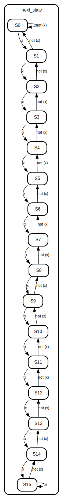

# Stochastic Computing - Progress Update: [21-28/8]

## Overview

The past week, I've been implementing stochastic computing (SC) using random bit stream generated with random module in the testbench. My goal was to finalize a basic demonstration of how stochastic computation works.

I have tested the basic building blocks of the SC circuit such as the addition, substitution, hyperbolic tangent function, and absolute value function, as well as the Robert cross operator.

## Discussion

### Insights

- Implementation of addition and subtraction program in Verilog:

- Implementation of the absolute value function and hyperbolic tangent function using LSM. Here there were only 16 states in the LSM:

- Result:
  - Tanh

  - Abs

- Implementation of Robert's cross operator for edge detection:

- Result:

### Conclusion

The results were promising, but further testing to determine the influence of various parameters on the accuracy is necessary. 

### Questions

- How can I quantitatively measure the influence of correlation on accuracy?
- What efficient methods can be employed to utilize deterministic bit streams or LSFRs instead of synthetic random bit streams?
- How can the Verilog code be adapted to accommodate varying numbers of states within the Linear State Machine?
- What is the most effective approach to implement neural networks using stochastic computing?

## Next Steps

For the upcoming weeks, I plan to:

1. Systematically varying parameters and quantifying their impact on results.
2. Study processes of digital probability convert (DPC) and vice versa. 
3. Study of traditional Verilog algorithms as a point of comparison.
4. Study of the output signals from the camera.
https://github.com/AngeloJacobo/FPGA_RealTime_and_Static_Sobel_Edge_Detection

1. FPGA implementation.

98.7 microW/pixel

2.7 W / 2048*1088 BU205M
